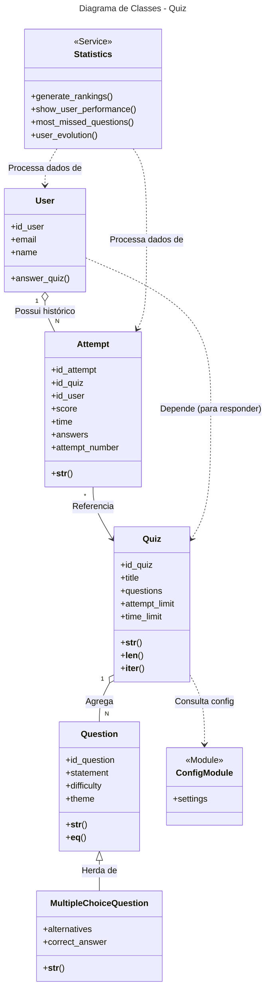
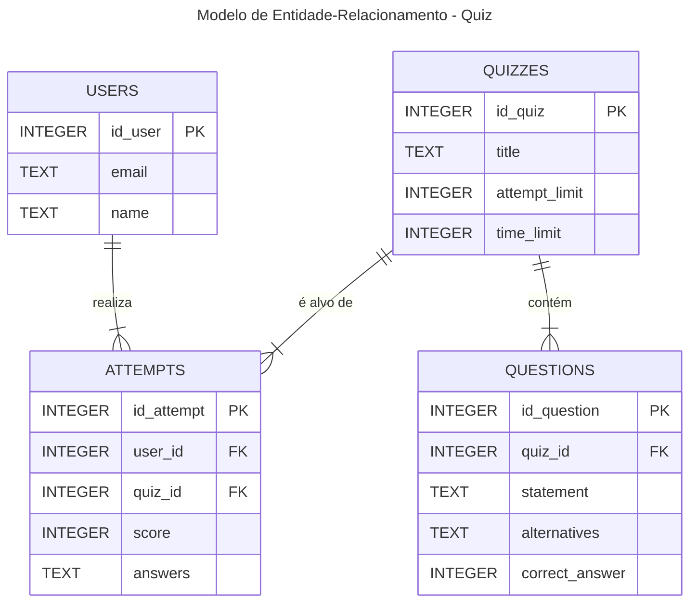

**Status:** Em Desenvolvimento (Entrega da Semana 3: Herança e DB)

## 1. Descrição do Projeto

Este projeto tem como objetivo o desenvolvimento de um sistema de quiz educacional. O sistema será uma aplicação de linha de comando (CLI) que permite aos usuários criar, gerenciar e responder quizzes com perguntas de múltipla escolha.

O sistema controlará a pontuação, o desempenho por tema, estatísticas de acertos e permitirá a geração de relatórios de progresso por usuário. A persistência dos dados é feita utilizando o SQLite, com as configurações gerenciadas por um arquivo settings.json.

O foco principal do projeto é a aplicação correta de conceitos de Programação Orientada a Objetos (POO), incluindo Herança, Encapsulamento e Composição.

## 2. Estrutura Planejada de Classes (UML Textual)

A modelagem do sistema foi dividida nas seguintes classes, atributos e métodos principais, conforme o solicitado:

| Classe | Atributos | Métodos Principais |
| :--- | :--- | :--- |
| **User** | `id_user`, `email`, `name` | `answer_quiz()` |
| **Question (Base)** | `id_question`, `statement`, `difficulty`, `theme` | `__str__()`, `__eq__()` |
| **MultipleChoiceQuestion**| `(Herda de Question)` `alternatives`, `correct_answer` | `__str__()` (sobrescrito) |
| **Quiz** | `id_quiz`, `title`, `questions`, `attempt_limit`, `time_limit` | `__str__()`, `__len__()`, `__iter__()` |
| **Attempt** | `id_attempt`, `id_quiz`, `id_user`, `score`, `time`, `answers`, `attempt_number` | `__str__()` |
| **Statistics** | `(Nenhum - Classe de serviço)` | `generate_rankings()`   `show_user_performance()`   `most_missed_questions()`   `user_evolution()` |

---

### 2.1. Diagrama de Classes (UML)

Aqui está o diagrama de classes UML que representa a estrutura do sistema:

### 2.2. Relacionamentos Principais

O sistema utiliza os quatro tipos principais de relacionamentos da Orientação a Objetos para estruturar os dados e as regras de negócio:

### 2.3 MER do projeto com o SQLite (Até o momento)

#### 1. Generalização/Especialização (Herança)
Representa a relação "é-um-tipo-de".

* **`MultipleChoiceQuestion` → `Question`**
    * A classe `MultipleChoiceQuestion` **é uma** especialização da classe base `Question`.
    * Ela herda automaticamente atributos comuns como `statement` (enunciado), `difficulty` (dificuldade) e `theme` (tema).
    * Ela estende a classe base adicionando atributos exclusivos: `alternatives` (lista de opções) e `correct_answer` (índice da resposta).

#### 2. Agregação ("Tem-um")
Representa a relação onde um objeto é composto por uma coleção de outros objetos.

* **`Quiz` <>— `Question`** - **1 para N**
    * Um objeto `Quiz` **agrega** uma lista de objetos `Question` (ou suas filhas, `MultipleChoiceQuestion`).
    * A relação é de agregação porque as perguntas podem existir independentemente do quiz.
* **`User` <>— `Attempt`** - **1 para N**
    * Um `User` **possui** um histórico (lista) de várias `Attempt` (tentativas). Isso permite gerar relatórios de evolução do usuário ao longo do tempo.

#### 3. Associação Simples ("Conhece-um")
Representa uma conexão direta onde um objeto precisa fazer referência a outro para funcionar, geralmente através de Identificadores Únicos.

* **`Attempt` → `Quiz`** - **N para 1**
    * Cada objeto `Attempt` (tentativa) está associado a exatamente **um** `Quiz`.
    * Essa associação é vital para garantir que os resultados (`score`, `time`) sejam atribuídos a pessoa e a prova corretas.

#### 4. Dependência ("Usa-um")
Representa uma relação mais fraca, onde uma classe "usa" outra temporariamente sem mantê-la como atributo fixo.

* **`Statistics` (Classe de Serviço) → `User`, `Attempt` e `Quiz`**
    * A classe `Statistics` **depende** das classes `User`, `Attempt` e `Quiz` para funcionar.
    * Seus métodos recebem listas desses objetos para processar cálculos e gerar relatórios analíticos.
* **`User` → `Quiz`**
    * A classe `User` tem uma dependência temporária do `Quiz` (através do método `answer_quiz`) para poder respondê-lo.
* **`Quiz` → `Settings`**
    * A classe `Quiz` consulta as configurações globais para definir seus valores padrão ou validar limites.

## 3. Visão Geral

* [X] **Modelagem OO:** Definição das classes, atributos, métodos e relacionamentos.
* [ ] **Criação de Perguntas:** Cadastrar perguntas de múltipla escolha com validações.
* [ ] **Montagem de Quizzes:** Criar quizzes a partir de um conjunto de perguntas.
* [ ] **Execução de Quizzes:** Permitir que usuários respondam quizzes e registrar seus resultados.
* [ ] **Usuários e Tentativas:** Cadastrar usuários e salvar seu histórico de tentativas.
* [ ] **Relatórios:** Gerar estatísticas de desempenho, rankings e mais.
* [X] **Persistência:** Salvar e carregar dados em JSON ou SQLite.
* [X] **Testes:** Cobertura de testes com `pytest`.
